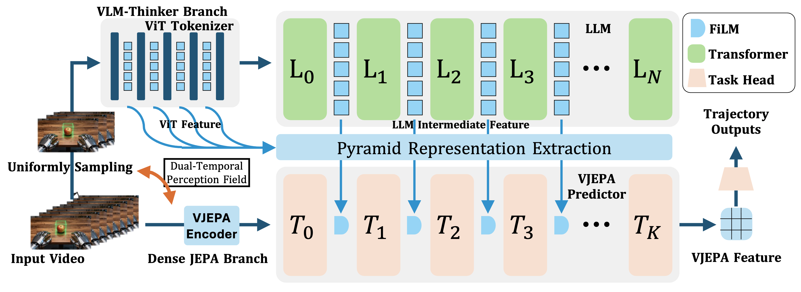

# ThinkJEPA: Empowering Latent World Models with Large Vision-Language Reasoning Model

<p align="center">
  <picture>
    <source media="(prefers-color-scheme: dark)" srcset="logo/logo-dark.png">
    
  </picture>
</p>

<p align="center"><strong>Official implementation of ThinkJEPA.</strong></p>

<p align="center">
  Haichao Zhang<sup>1</sup>, Yijiang Li<sup>2</sup>, Shwai He<sup>3</sup>, Tushar Nagarajan<sup>4</sup>, Mingfei Chen<sup>5</sup>,<br>
  Jianglin Lu<sup>1</sup>, Ang Li<sup>3</sup>, and Yun Fu<sup>1</sup>
</p>

<p align="center">
  <sup>1</sup> Northeastern University
  &nbsp;&nbsp;
  <sup>2</sup> University of California San Diego
  &nbsp;&nbsp;
  <sup>3</sup> University of Maryland
  &nbsp;&nbsp;
  <sup>4</sup> The University of Texas at Austin
  &nbsp;&nbsp;
  <sup>5</sup> University of Washington
</p>

<p align="center">
  For questions about this public release, or if you encounter any issues reproducing the released setup, please contact Haichao Zhang:
  <a href="mailto:zhang.haich@northeastern.edu">zhang.haich@northeastern.edu</a>
</p>

<p align="center">
  <a href="https://arxiv.org/abs/2603.22281"><strong>Paper</strong></a> |
  <a href="https://github.com/Hai-chao-Zhang/ThinkJEPA"><strong>GitHub</strong></a> |
  <a href="https://huggingface.co/datasets/haichaozhang/cache"><strong>Released Preprocessed Cache</strong></a> |
  <a href="#citation"><strong>Citation</strong></a> |
  <a href="#license"><strong>License</strong></a>
</p>

ThinkJEPA is a dual-path embodied prediction framework in which a vision-language model acts as a cortex-like reasoner for high-level semantics and long-horizon intent, while a JEPA branch acts as a cerebellum-like controller for low-level dynamics, physical consistency, and rapid local correction. This repository is the public ThinkJEPA release for reproducing the released training and evaluation setup on EgoDex-style data and cache inputs.

<p align="center">
  <picture>
    <source media="(prefers-color-scheme: dark)" srcset="logo/thinkjepa-dark.png">
    
  </picture>
</p>

## Overview

- The VLM-thinker branch provides high-level reasoning guidance from Qwen3-VL-Thinking features.
- The dense JEPA branch models video dynamics and supplies low-level embodied features for prediction.
- The released training path predicts future trajectory outputs from JEPA features conditioned by pyramid guidance from the VLM branch.
- This public snapshot is intentionally minimal: it includes the core train/eval code, preprocessing scripts, retained EgoDex helpers, and a bundled `vjepa2/` dependency subtree required by the released path.

## Repository Layout

```text
thinkjepa/
├── cache_train/
│   ├── generate_egodex_split_manifest.py
│   ├── build_video_cache_splits.py
│   ├── qwen3_cache_extractor.py
│   ├── qwen3_parallel_cache_extractor.py
│   ├── thinker_train.py
│   ├── thinker_predictor.py
│   ├── models.py
│   ├── predictor.py
│   ├── hf_egodex.py
│   └── run_main_egodex_suite.py
├── egodex/
├── scripts/
│   ├── train.sh
│   └── eval_main.sh
├── vjepa2/
├── logo/
├── LICENSE
├── NOTICE
├── CITATION.cff
├── CITATION.bib
├── RELEASE_AUDIT.md
├── requirements-extraction.txt
└── requirements-public.txt
```

## Environment Setup

### Train / Eval Environment

For training and evaluation, we recommend a V-JEPA2-aligned environment.
On this machine, the known working training environment was a conda env similar to `vjepa` with:

- Python `3.11.15`
- `torch==2.10.0+cu128`
- `torchvision==0.25.0+cu128`
- `torchaudio==2.10.0+cu128`
- `decord==0.6.0`
- `numpy==2.3.5`
- `h5py==3.16.0`
- `opencv-python==4.13.0.92`
- `pillow==12.0.0`
- `pyyaml==6.0.3`
- `timm==1.0.25`
- `einops==0.8.2`

Example setup:

```bash
conda create -n thinkjepa-train python=3.11 -y
conda activate thinkjepa-train

# Install a PyTorch stack that matches your CUDA runtime and wheel index.
# The local working environment used CUDA 12.8 wheels.
pip install torch==2.10.0+cu128 torchvision==0.25.0+cu128 torchaudio==2.10.0+cu128

pip install -r requirements-public.txt
```

The release already bundles the `vjepa2/` source subtree used by the documented ThinkJEPA path. By default, the wrapper scripts point `VJEPA2_ROOT` to `./vjepa2`.

The upstream `vjepa2/requirements.txt` contains a broader research stack, including tools such as `tensorboard` and `wandb`. Those extras are not required by the released ThinkJEPA train/eval path.

### Qwen3-VL Extraction Environment

If you want to run cache extraction yourself, use a dedicated Qwen3-VL environment instead of reusing the lean train/eval env. On this machine, the known working extraction environment was a conda env similar to `qwen3vl` with:

- Python `3.10.19`
- `torch==2.10.0`
- `torchvision==0.25.0`
- `torchaudio==2.10.0+cu128`
- `torchcodec==0.10.0+cu128`
- `transformers==5.2.0`
- `qwen-vl-utils==0.0.14`
- `huggingface-hub==1.4.1`
- `decord==0.6.0`
- `numpy==2.2.6`
- `h5py==3.16.0`
- `pillow==12.1.1`
- `matplotlib==3.10.8`
- `pyyaml==6.0.3`
- `accelerate==1.12.0`
- `sentencepiece==0.2.1`
- `safetensors==0.7.0`

Example setup:

```bash
conda create -n qwen3vl python=3.10 -y
conda activate qwen3vl

# Install a PyTorch + torchcodec stack that matches your CUDA runtime and wheel index.
# The local working extraction environment used CUDA 12.8 wheels.
pip install torch==2.10.0 torchvision==0.25.0 torchaudio==2.10.0
pip install torchcodec==0.10.0+cu128

pip install -r requirements-extraction.txt
```

The extraction scripts default to `--force_video_backend torchcodec`. If `torchcodec` is unavailable on your machine, switch the backend to `decord` explicitly.
If you only plan to reproduce training/evaluation from the released Hugging Face cache, you can skip this extraction environment entirely.

### Optional Checkpoint Setup

If you need pretrained JEPA weights, provide them through environment variables instead of editing local paths directly:

```bash
export THINKJEPA_JEPA_VITL_PT=<CHECKPOINT_PATH>
```

## Data And Cache Preparation

### Option A: Use The Released Prepared Cache

We provide a prepared cache release on Hugging Face:

- https://huggingface.co/datasets/haichaozhang/cache

This is the recommended path for reproducing the released ThinkJEPA setup without rebuilding Qwen3-VL features locally.

```bash
HF_HOME=<HF_HOME> \
DATA_DIR=hf://datasets/haichaozhang/cache/part2 \
CACHE_DIR=hf://datasets/haichaozhang/cache/part2 \
TRAIN_MANIFEST=hf://datasets/haichaozhang/cache/egodex_part2_video_cache_subset2000_ratio0.9_seed42/splits/train_cache.txt \
TEST_MANIFEST=hf://datasets/haichaozhang/cache/egodex_part2_video_cache_subset2000_ratio0.9_seed42/splits/test_cache.txt \
VJEPA2_ROOT=$PWD/vjepa2 \
bash scripts/train.sh
```

### Option B: Download Raw EgoDex And Build Cache Locally

Raw EgoDex is distributed by the official EgoDex project:

- EgoDex repository: https://github.com/apple/ml-egodex
- EgoDex paper: https://arxiv.org/abs/2505.11709

Example download for `part2`:

```bash
curl "https://ml-site.cdn-apple.com/datasets/egodex/part2.zip" -o part2.zip
unzip part2.zip
```

Expected layout:

```text
<DATA_ROOT>/part2/<task_name>/<episode>.mp4
<DATA_ROOT>/part2/<task_name>/<episode>.hdf5
```

### Generate Split Manifests

```bash
python cache_train/generate_egodex_split_manifest.py \
  --data_root <DATA_ROOT>/part2 \
  --output_dir <SPLIT_ROOT>/part2_ratio0.9_seed42 \
  --glob_pattern "*.hdf5" \
  --train_ratio 0.9 \
  --split_seed 42
```

### Extract Qwen3-VL-Thinking Cache

The released ThinkJEPA setup uses Qwen3-VL-Thinking features. The public release includes:

- `cache_train/qwen3_cache_extractor.py`
- `cache_train/qwen3_parallel_cache_extractor.py`

These scripts are intended to run from the dedicated Qwen3-VL extraction environment described above.

Minimal parallel extraction example:

```bash
python cache_train/qwen3_parallel_cache_extractor.py \
  --file_dir <DATA_ROOT>/part2 \
  --output_dir <CACHE_ROOT>/part2 \
  --pretrained Qwen/Qwen3-VL-2B-Thinking \
  --layers 0 4 8 12 16 20 24 27 \
  --max_frames 32 \
  --max_new_token_num 16 \
  --batch_size 20 \
  --save_dtype fp16 \
  --res 256 \
  --prompt "Describe this video."
```

This produces per-video `.npz` cache files aligned with the EgoDex video tree.

### Build Cache-Aligned Train/Test Manifests

```bash
python cache_train/build_video_cache_splits.py \
  --dataset egodex \
  --data_root <DATA_ROOT>/part2 \
  --cache_root <CACHE_ROOT>/part2 \
  --output_dir <SPLIT_ROOT>/egodex_part2_video_cache_subset2000_ratio0.9_seed42 \
  --subset_size 2000 \
  --train_ratio 0.9 \
  --split_seed 42
```

## Training

```bash
DATA_DIR=<DATA_ROOT_OR_HF_SPEC> \
CACHE_DIR=<CACHE_ROOT_OR_HF_SPEC> \
TRAIN_MANIFEST=<TRAIN_MANIFEST_OPTIONAL> \
TEST_MANIFEST=<TEST_MANIFEST_OPTIONAL> \
VJEPA2_ROOT=$PWD/vjepa2 \
bash scripts/train.sh
```

## Evaluation

```bash
DATA_DIR=<DATA_ROOT_OR_HF_SPEC> \
CACHE_DIR=<CACHE_ROOT_OR_HF_SPEC> \
TRAIN_MANIFEST=<TRAIN_MANIFEST_OPTIONAL> \
TEST_MANIFEST=<TEST_MANIFEST_OPTIONAL> \
VJEPA2_ROOT=$PWD/vjepa2 \
bash scripts/eval_main.sh
```

## Third-Party Sources

This release retains third-party components that are necessary for the released reproduction path.

- EgoDex-derived helpers under `egodex/` are adapted from Apple's EgoDex project.
  - Source repository: https://github.com/apple/ml-egodex
  - Retained notice files:
    - `egodex/LICENSE.txt`
    - `egodex/ACKNOWLEDGEMENTS.txt`
    - `egodex/utils/LICENSE.txt`
    - `egodex/utils/ACKNOWLEDGEMENTS.txt`
- The bundled `vjepa2/` subtree is derived from the V-JEPA2 repository.
  - Source repository: https://github.com/facebookresearch/vjepa2
  - Retained notice files:
    - `vjepa2/LICENSE`
    - `vjepa2/APACHE-LICENSE`

These third-party notices continue to apply to their respective subtrees and are not replaced by the root ThinkJEPA release license.

## Citation

If you use ThinkJEPA, please cite the paper and link to the original repository:

- Repository: https://github.com/Hai-chao-Zhang/ThinkJEPA

```bibtex
@article{zhang2026thinkjepa,
  title={ThinkJEPA: Empowering Latent World Models with Large Vision-Language Reasoning Model},
  author={Zhang, Haichao and Li, Yijiang and He, Shwai and Nagarajan, Tushar and Chen, Mingfei and Lu, Jianglin and Li, Ang and Fu, Yun},
  journal={arXiv preprint arXiv:2603.22281},
  year={2026}
}
```

See `CITATION.cff` and `CITATION.bib` for machine-readable and BibTeX citation metadata.

## Attribution

If you use, modify, or redistribute ThinkJEPA or derivative code, please:

- retain the `LICENSE` and `NOTICE` files
- retain applicable third-party notices that ship with the repository
- cite the ThinkJEPA paper where citation practices apply
- include a link to the original repository: https://github.com/Hai-chao-Zhang/ThinkJEPA

## License

The root repository is released under the custom `ThinkJEPA Attribution License (BSD-3-Clause-based, custom)`. Redistribution and modification are broadly permitted, provided that required attribution, notice retention, change-marking, and repository-link requirements are followed.

See:

- `LICENSE`
- `NOTICE`
- `RELEASE_AUDIT.md`

## Release Scope

This public release intentionally excludes private datasets, unpublished internal manifests, private checkpoints, experiment logs, notebook artifacts, and unrelated experimental code paths. Use the linked GitHub and Hugging Face resources where appropriate.
